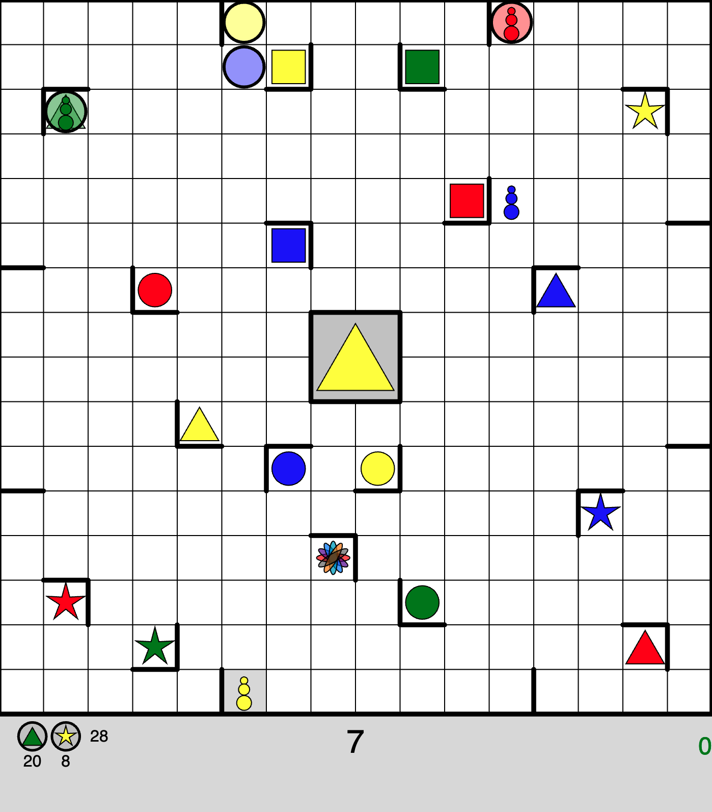
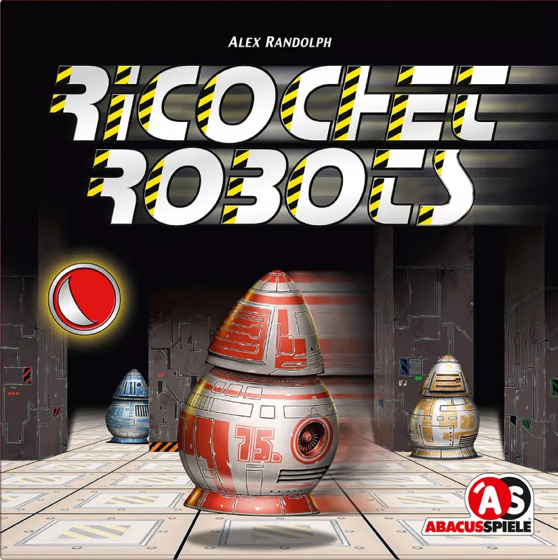
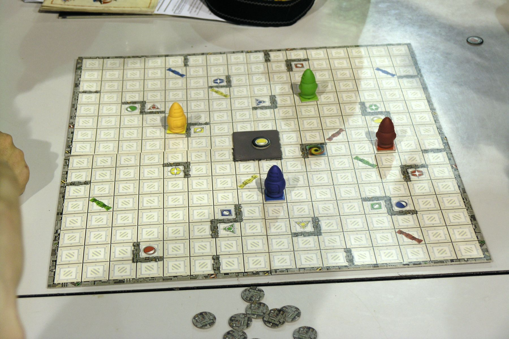

# Ricochet Robots

My (very WIP) [p5.js](https://p5js.org/) implementation of the out-of-print, surprisingly fun mental-shape-translation game [Ricochet Robots](https://en.wikipedia.org/wiki/Ricochet_Robots)

Try out the latest* version in the [p5 Editor](https://editor.p5js.org/briansmiley/sketches/LJjfo8k1P)

**Instructions**
-
-Click to select a robot
         
-`w` `a` `s` `d` or `↑` `←` `↓` `→` to move

-Robots move until they hit a wall or another robot

-Goal is to make the matching color robot reach the target shape in as few moves as possible (rainbow shape can be reached by any color)

-`r` to reset current solution attempt

-Clicking center shape resets turn and selects a new token

-Click collect next to player who proposed the fastest route

-Full original game instructions [here](https://images-cdn.zmangames.com/us-east-1/filer_public/c0/b4/c0b482f1-ad3e-4e5d-ae48-0c11aa7c317a/en-ricochet_robot-rules.pdf)

*as of 4/30/24

*App screenshot*

*Original box art*

*Physical game*

